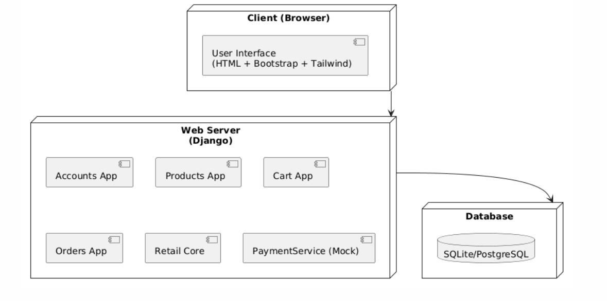
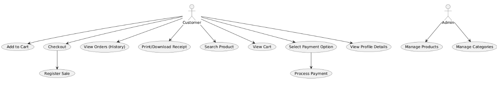

# UML CP1 (4+1 Views) 

- ## Logical: Class diagram.

- ## Process: System Sequence diagram . 

- ## Deployment: Client + DB. 

- ## Implementation: Package/module diagram. 

- ## Use-Case: Register Sale, and all other use cases you implemented.

# CP2 Updated Diagrams
- ## Logical: Class diagram.

- ## Deployment: Client + DB. 

- ## Implementation: Package/module diagram. 

# UML CP3 (4+1 Views) 

- ## Logical: Class diagram.

- ## Deployment: Client + DB. 

- ## Implementation: Package/module diagram. 

- ## Process: System Sequence Diagrams

### Register Sale Sequence Diagram

### User Login Sequence Diagram

### Browse Products Sequence Diagram

### Add to Cart Sequence Diagram

### Checkout Flow Sequence Diagram

### Flash Sale Checkout Sequence Diagram

### Create RMA Request Sequence Diagram

### Process RMA (Admin) Sequence Diagram

### Partner Feed Ingestion Sequence Diagram

### View Metrics Dashboard Sequence Diagram
