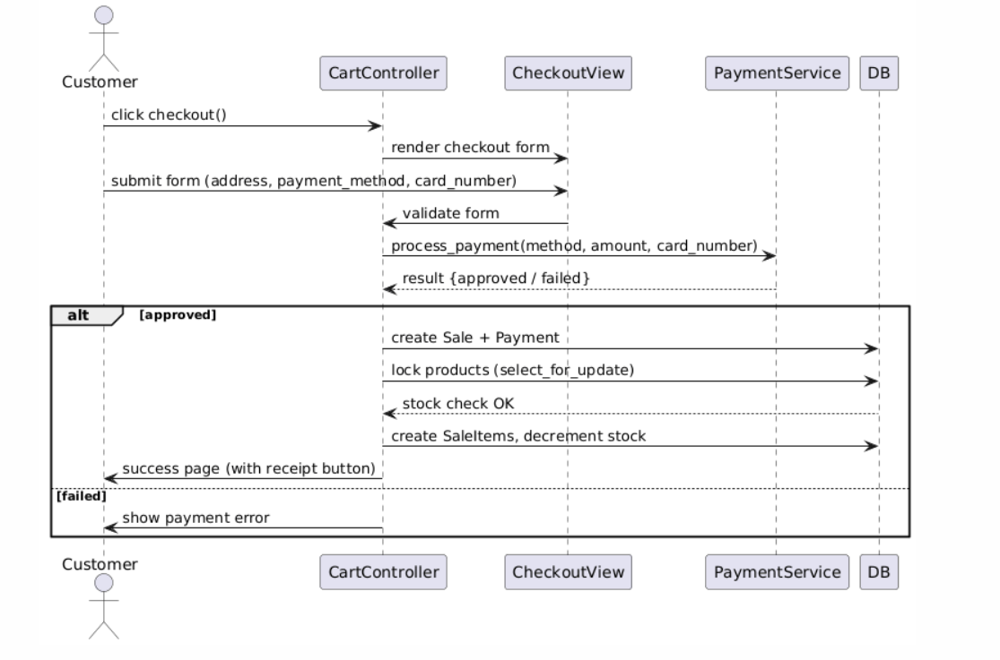

# UML CP1 (4+1 Views) 

- ## Logical: Class diagram.

- ## Process: System Sequence diagram . 

- ## Deployment: Client + DB. 

- ## Implementation: Package/module diagram. 

- ## Use-Case: Register Sale, and all other use cases you implemented.

# CP2 Updated Diagrams
- ## Logical: Class diagram.

- ## Deployment: Client + DB. 

- ## Implementation: Package/module diagram. 

